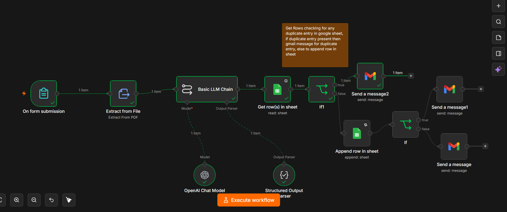
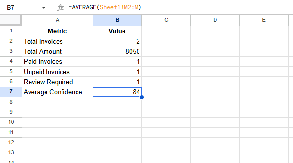
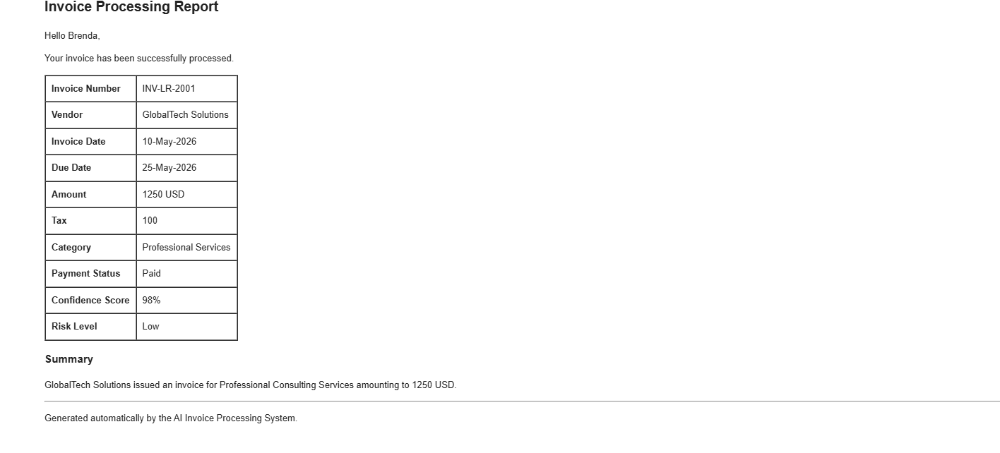
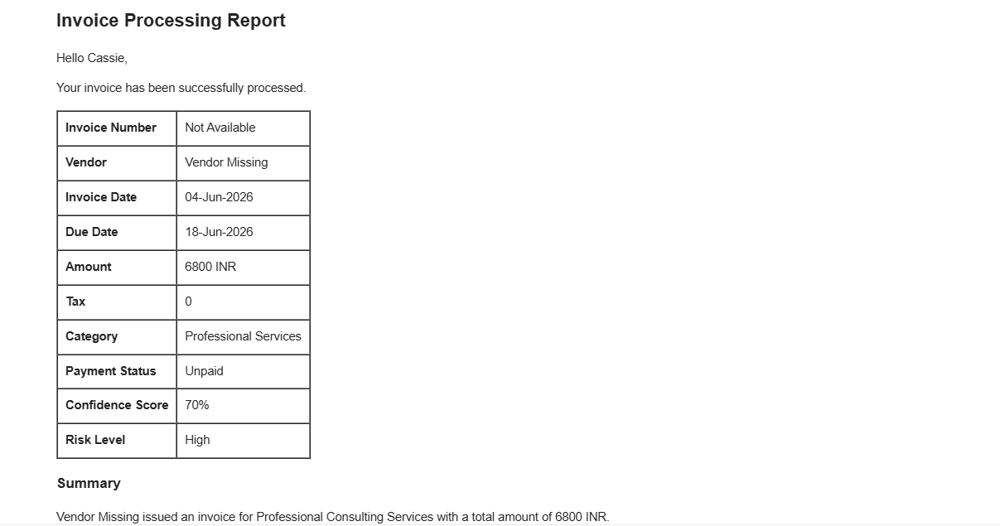
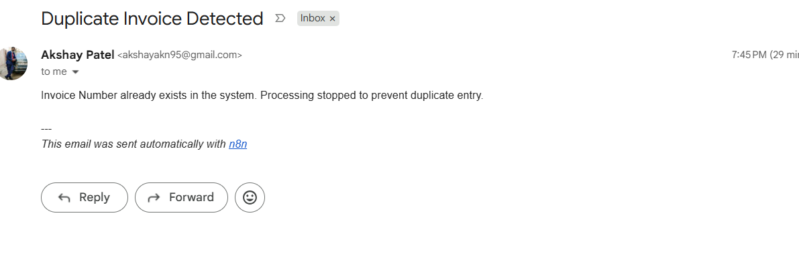
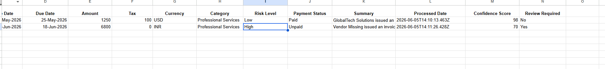

# AI Invoice Processing & Accounts Payable Automation

AI-powered invoice processing workflow built using n8n, OpenAI, Google Sheets, and Gmail.

## Features

- PDF Invoice Upload
- AI Invoice Data Extraction
- Confidence Score Generation
- Risk Level Classification
- Duplicate Invoice Detection
- Google Sheets Integration
- Automated Email Notifications
- Dashboard Reporting

---

## Workflow Architecture



---

## Google Sheets Dashboard



---

## Successful Processing Email



---

## High Risk Invoice Alert



## duplicate alert


## Google Sheet Image



---

## Workflow

```text
Invoice Upload
      ↓
PDF Extraction
      ↓
OpenAI Analysis
      ↓
Risk Assessment
      ↓
Duplicate Detection
      ↓
Google Sheets Storage
      ↓
Email Notification
```

## Tech Stack

- n8n
- OpenAI
- Google Sheets
- Gmail
- PDF Processing

## Business Benefits

- Automates invoice processing
- Reduces manual effort
- Detects duplicate invoices
- Flags high-risk invoices
- Generates automated reports

## Demo Video

[Add your Loom video link here.](https://www.loom.com/share/26db632707634d0587295825ed4204de)

## Author

Akshay Patel
